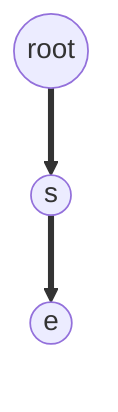

#lecture #IR 

## Dictionary Construction 
**searching words in vocabulary**

In comparision based system best you can get it $\theta(\log(n))$   

so we want the following features in a search 
search ? 
- Data structure 

#### Possible Solutions 
## Hashing
- Full control over data memory or data segments 
- Direct memory access
- Collision

Problem with hashing is not collision , it is the fact that we want to store similar words closer to each other , which in hashing similar words might have different hashes 

#### Binary Search Tree 
with binary search tree search is going to be fast , 

**Drawback**
- Balance in Binary search tree
- Insert and deletion. 

It is more suitable when your vocabulary does not change a lot.
We can use B+ or tree other variants of BST , we use B+ trees in DBMS for 
storing indexes.

But they come with computational complexity , and pointers and a lot restructuring.

### Tries 
One of the best data structure , tries are very efficient data structure for IR related tasks , 

## Fault Tolerance 
- Wildcard Queries 
- Suffix Query 
- Prefix Query

Most IR systems employing Tries as DS also maintain a reverse trie , 
to search  for prefix query 

**Prefix Suffix Queries**
  \*ot\*  
  Just take intersecton of 
$$
	S_U = Prefix\ Queries\ Results \
	S_R = Suffix \ Queries \ Results
$$
$$
	 Result = S_U \cap \ S_R
$$
### Permuterm Index 
Given a word in voacbulary : 
- append OOV out of vocabulary character 
- make a index of each rotation of the word , and make an entry in permuterm index  ,and which points it to the orignal word.
- Next we take the search term add the OOV and rotate the search term untill a wild cards are at the end

**Steps involved in Permuterm search**
- query 
- rotate 
- match 
- "superset"
- manual intervention ( additional algortihm to eliminate)
- eliminate

Next -> K-term indexes