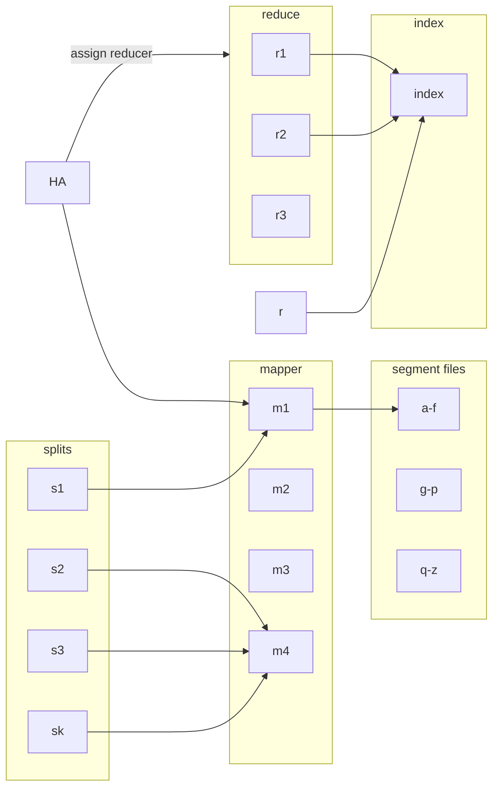
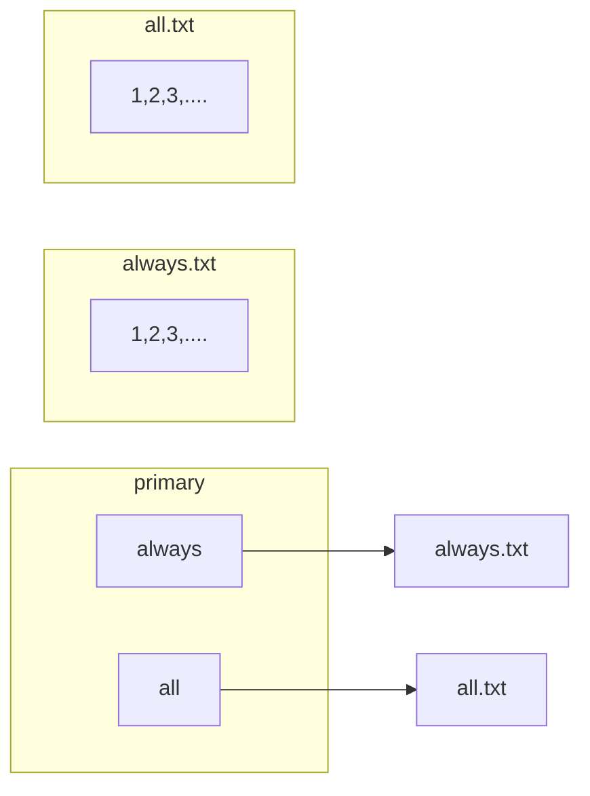

#lecture #IR 
# Building Indexes
1. BSBI 
2. SPIMI
3. Distributed Indexing

For an enterprise a single computer machine is not enough we need distributed indexing is required we need some sort of map reduced systems. 
- Map_reduce 
- Hadoop 

## Commodity PC 
- Multiple Computer's (often in 1000's )

 High Prob of failure  
	 Reassiginng jobs

**Splits**
No of documents needs to be tokenized 
$K_s = 50 \ \text{segment size}$  

The pool of machine resources one set works as mapper other remaining works as reducers , all this assigned by **Hadoop Admin** 

### Dynamic Indexing 
$$ Index \ Creation \ \to \begin{array}{c,c,c} static & index & posting \ list \end{array} $$
#### File per token approach 

#### Single index 
<--!Write here--> 
When corpus is changed the index needs to be changed as well 

> [!note]
> When the documents is updated itself how should we update the index

**Can be rebuild index for each new docuemtn or update ?**
 - file per token system only works for small vocabulary size 
 - preffered  way is the single index for large vocabulary and corpus
 
 #### Linear merge

> [!note]
> Google 's dance 

- The time google is not answering anything it performs what is knows as 
 google's dance .

We maintain an auxilary index in primary index and a static index in secondary memory 
- we limit the size of auxillary index
- when auxillary index it is written to static index while merging

$$
	\text{The amount of time required to merge the auxillary index = } 
$$
$$ 
 T = \text{Total no of posting (x,y)} \\
 $$
 $$
 n = \text{size of Ia in terms of posting}
$$
$$
	\theta(\frac{T^2}{n})
$$
