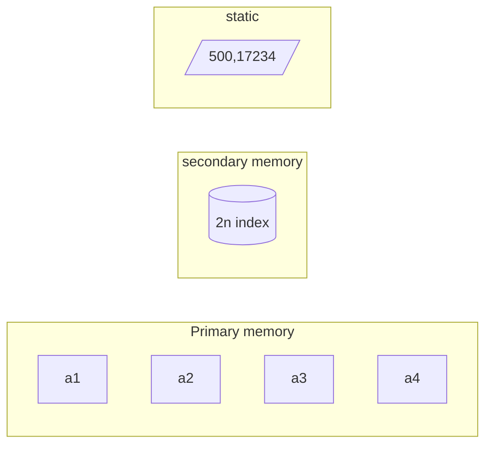

#lecture  #IR 
# Dynamic Indexing 

> If an index cannot be created as a static index 




$$ \{Static \ index \} \cup \{Aux\ index\}$$

> [!question] Should the value of `<n>` should be big or small ?

> since the time complexity is inversely proportional to size of n , the should not be very less 

> What are the compromises we can make ? 
>  - Multiple indexes 

 - We generally don't go for linear merge 
 - We go for logarithmic merge 

```mermaid 
graph LR 
	subgraph pm["Primary Memory"] 

	end

	subgraph ss["secondary storage"]
	 
	end
```

So basically play 2048 for making the index 

- I always keep the auxillary memory of same size but as soon as i fill the maximum i can merge i merge it 
$$ n+2n+4n+8n+kn$$
$$n[1+2+2^2+2^3]$$
$$ n(2^k) \le T $$


## Log Merge 
[Log Merge](enter the url here for the log merge)

if the auxillary index if full write it onto the secondary memory 

> [!Important] Problems that can be asked in Mid-Sems 
> This is the data , what is the size of indexe or how many indexes there are which index is file there. 

> [!caution] Don't take the algorithm for face value
>  The multiple indexing approach is good for merging operations , but they are not good for querying as the query term if is typo need to be searched across multiple indexes ? 

### Index Compression 

$$
\begin{matrix}
n_1 & n_2 & n_3 \\
n_4 & n_5  & n_1 \\
n_2 & n_3 & n_4 \\
n_1 & n_2 & n_3 \\
\end{matrix}
$$

Since in index the terms are in string and the posting are int we cannot compress 

- We should employ for lossless compression so that we can recreate the original vocabulary

> [!note] Motivation ? why do we need to compression
> Due to Heap's law  


$$M = Kt^b$$
$$\begin{align}
	& \log {M} = log{kt^b}\\
	& \log {M} = \log {k} + b \log{t} \\
	& \log {M} = b\log {t} +  \log{k} \\
	& y = mx+c \\
	&	30 \le k \le 100\\
	&	b = 0.5
\end{align}
$$
$$\text{ M = number of unique token , T = number of total tokens } $$


> [!inference] 
> The Number of unique words is a logarithmic scale to number of documents 


> [!note] The value of K varies a lot !! 
> The variation of values of k is due to proper nouns as the number of words in English Language are limited but we do not have any control of the proper nouns

