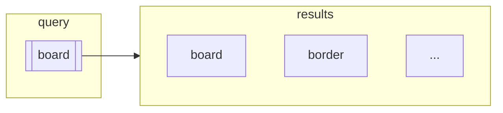

#IR #lecture 
# Proximity Distance 
- Levenshtein distance 
$$ dist(s1,s2) \ where \ s1 , s2 \ are \  two \ strings $$

 

### Choosing a substitute 

```mermaid 
graph LR
	subgraph
	token["token"] 
	end
	subgraph "Vocabulary 50,000"
	direction TB
	t1["t1"] 
	 t2["t2"]
	 t3["..."] 
	 t5000["50,000"] 
	end
```

### Some heuristic 
Some ad-hoc rules that are true assumed based on the domain knowledge, 

> [!NOTE] Heuristic 
> Since it is unlikely that user put first character in wrong spelling , we can make a heuristic that token need to be matched with smae letter as that to first character 
> - Starts with the same alphabet 

Using permuterms , 
find all the rotations of search term then check for word s in the rotations 

Using ***K-terms*** : 


> [!note] Jaccard Coffiecient 
> Standard for computing similarity between categorical objects 

$$ J(BORD,BOARD) = \frac{| A \cap B |}{|A \cup B|} \ (Jaccard\ Coffiecient)$$
> [!important] Midsems Important 
> 1. Jaccard 
> 2. Levenshtein Calculation 
> 3. Proximity Distance


### IN CONTEXT CORRECTIONS 

```
flew form IGT
```

In isolation individual terms are not spell errors but in together they do not make sense 

Inferring nouns from verbs in query terms falls udner 
- NLP 

but for IR purpose we can still make  Statisical analysis

## Building Indexes 
We cannot make an IR systems without having knowledge of hardware 


> [!example]
> ## Reuters -RCV1
> No of Documents -> 800,000
> Token -> 10<sup>8</sup>

Next --> Index Compression 