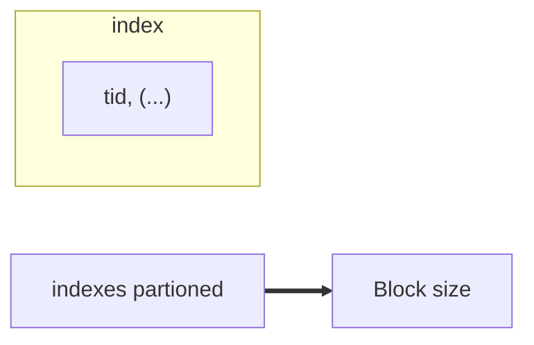

#lecture #IR 

# Index Creation 
> Index creationg is closely related to hardware
> Secondary Memory 
> 	Entire vocabulary cannot be  stored in Primary Memory 
> 	

**Latency** :
The spindle has to spin around for data reading in the secondary storage device . 

We need to understand these latencyies 




> We should put the entire indexes as a block , that is make the index till 64 kb , then store it in secondary memory 

> [!important]
> The os also optimizes to put file pointers in the continoues manner 
> 

[[Defragmentation]]

### Index Creation Methods 
#### **BSB Index**
Blocked sort based indexing 

#### Algorithm : 

```
		BLOCK_SIZE = 64 KB 
		BSBIndex() : 
			n = null 
			while docs left to process : 
				block  = PARSE_NEXT _BLOCK() // Read till next block of secondary storage 
			BSB_INVERT(block) // From the vocab make the posting list 
			n = n+1
			WRITE_BLOCK(block , fn)
```

```

MERGE_BLOCKS(f1,f2,f3,....,fn , fmerged):
	
```

> [!note] 
> The vocabulary index itself will start taking more space that cannot be fit into primary table 


## SPIMI 
**Single phase in memory index** 

- No token id 
- Hash files as dictionary 
	using a $(key ,value) \ = (token , doc_id)$
- No sorted Merge

[SPIMI Algo](https://nlp.stanford.edu/IR-book/html/htmledition/single-pass-in-memory-indexing-1.html)

> [!important]
>  - Last step of spimi is also merge opertaion on wroten dict 
>  - SPIMI is orders in magnitude in faster than BSB  because it doesn't have linear searches of the 
> 
# Next Distributed INdexes
